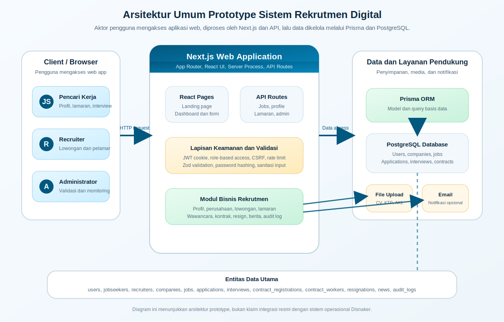
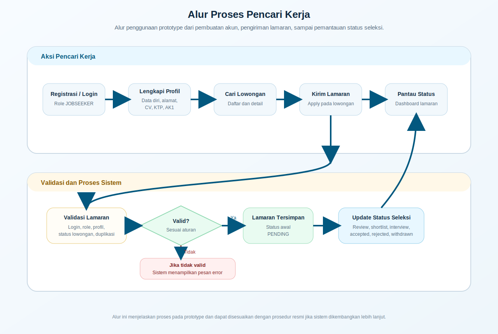
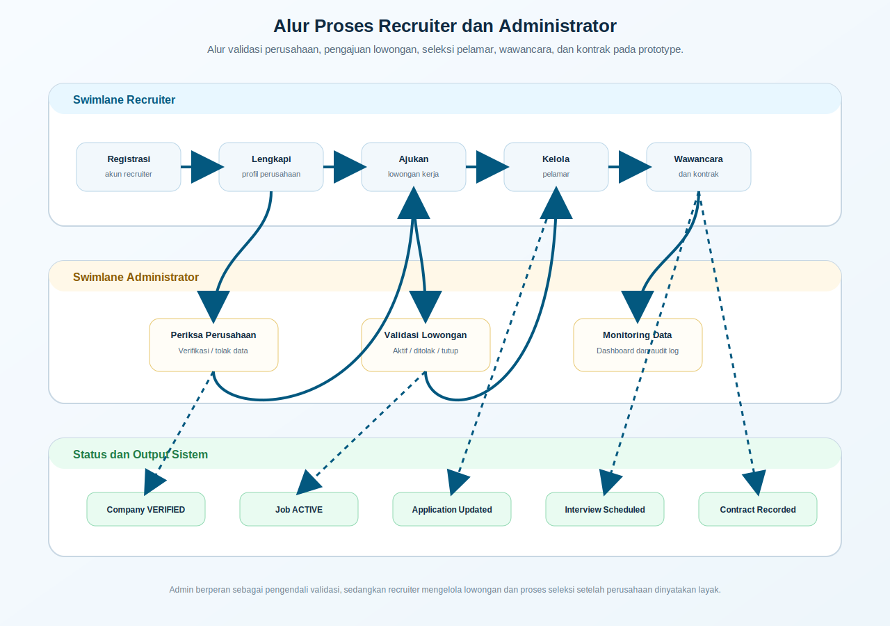
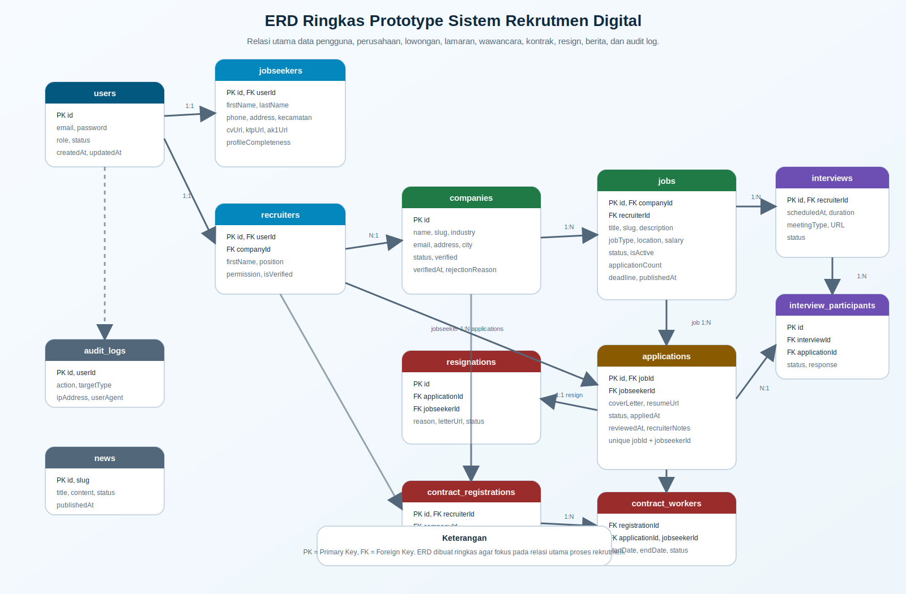

# BAB IV HASIL DAN PEMBAHASAN

> Catatan penggunaan: draft ini memposisikan aplikasi sebagai prototype sistem rekrutmen digital. Hindari mengubah narasi menjadi klaim bahwa sistem sudah menjadi sistem resmi atau sudah digunakan secara operasional oleh Dinas Tenaga Kerja Kabupaten Cirebon apabila belum ada bukti implementasi resmi.

## 4.1 Gambaran Umum Sistem

Sistem yang dikembangkan pada penelitian ini merupakan prototype aplikasi rekrutmen digital berbasis web yang dirancang untuk membantu proses penyampaian informasi lowongan kerja, pengelolaan data pencari kerja, pengajuan lowongan oleh perusahaan, pengelolaan lamaran, serta pemantauan proses seleksi. Prototype ini dikembangkan sebagai usulan pengembangan layanan ketenagakerjaan digital yang lebih terintegrasi, khususnya dalam mendukung kebutuhan informasi dan administrasi rekrutmen tenaga kerja.

Secara umum, sistem menyediakan tiga jenis pengguna utama, yaitu pencari kerja, perusahaan atau recruiter, dan administrator. Pencari kerja dapat membuat akun, melengkapi profil, mengunggah dokumen pendukung, mencari lowongan, mengirim lamaran, serta memantau status lamaran melalui dashboard. Recruiter dapat mendaftarkan perusahaan, melengkapi profil perusahaan, mengajukan lowongan, melihat daftar pelamar, memperbarui status lamaran, dan menjadwalkan wawancara. Administrator dapat melakukan pemantauan data, memverifikasi perusahaan, memvalidasi lowongan, mengelola berita, melihat data pencari kerja, mengelola kontrak, serta memantau audit log.

Prototype ini tidak dimaksudkan sebagai pengganti langsung dari website resmi Disnaker Kabupaten Cirebon, melainkan sebagai model sistem usulan yang dapat digunakan untuk menunjukkan bagaimana proses rekrutmen dapat dikelola secara lebih terstruktur melalui platform digital.

Tabel 4.1 Aktor Sistem dan Hak Akses

| Aktor | Deskripsi | Hak Akses Utama |
| --- | --- | --- |
| Pencari kerja | Pengguna yang mencari pekerjaan dan mengirim lamaran | Registrasi, login, melengkapi profil, mengunggah dokumen, mencari lowongan, melamar pekerjaan, melihat status lamaran, merespons jadwal wawancara |
| Recruiter | Perwakilan perusahaan yang membuka lowongan pekerjaan | Registrasi perusahaan, melengkapi profil perusahaan, mengajukan lowongan, melihat pelamar, memperbarui status lamaran, menjadwalkan wawancara, mengelola kontrak pekerja |
| Administrator | Pengelola sistem dari sisi layanan | Verifikasi perusahaan, validasi lowongan, pemantauan data pencari kerja, pengelolaan berita, pengelolaan kontrak, pemantauan audit log dan statistik sistem |

## 4.2 Analisis Kebutuhan Sistem

Analisis kebutuhan sistem dilakukan untuk memastikan bahwa prototype yang dibangun sesuai dengan permasalahan dan tujuan penelitian. Kebutuhan sistem dibagi menjadi kebutuhan fungsional dan kebutuhan nonfungsional.

### 4.2.1 Kebutuhan Fungsional

Tabel 4.2 Kebutuhan Fungsional Sistem

| Kode | Kebutuhan Fungsional | Implementasi Pada Prototype |
| --- | --- | --- |
| F-01 | Sistem menyediakan registrasi dan login pengguna berdasarkan peran | Tersedia registrasi untuk pencari kerja dan recruiter, serta autentikasi pengguna berdasarkan role JOBSEEKER, RECRUITER, dan ADMIN |
| F-02 | Sistem menyediakan pengelolaan profil pencari kerja | Pencari kerja dapat mengisi data diri, pendidikan, lokasi, preferensi pekerjaan, dan dokumen pendukung seperti CV, KTP, AK1, ijazah, sertifikat, dan surat pengalaman |
| F-03 | Sistem menyediakan pendaftaran dan pengelolaan profil perusahaan | Recruiter dapat mendaftarkan perusahaan dan melengkapi informasi perusahaan sebelum dapat memposting lowongan |
| F-04 | Sistem menyediakan verifikasi perusahaan | Administrator dapat memverifikasi atau menolak data perusahaan yang diajukan recruiter |
| F-05 | Sistem menyediakan pengajuan lowongan pekerjaan | Recruiter dapat membuat lowongan dengan informasi jabatan, deskripsi, persyaratan, lokasi, tipe pekerjaan, gaji, benefit, jadwal kerja, dan skill |
| F-06 | Sistem menyediakan validasi lowongan oleh administrator | Lowongan yang diajukan dapat berstatus pending, aktif, ditolak, atau ditutup sesuai proses validasi admin |
| F-07 | Sistem menyediakan pencarian dan tampilan lowongan | Pengguna dapat melihat daftar lowongan dan detail lowongan yang tersedia pada halaman publik |
| F-08 | Sistem menyediakan pengiriman lamaran pekerjaan | Pencari kerja dapat mengirim lamaran pada lowongan tertentu setelah login dan memiliki profil yang diperlukan |
| F-09 | Sistem mencegah pencatatan lamaran ganda pada lowongan yang sama | Basis data menerapkan kombinasi unik antara lowongan dan pencari kerja pada data lamaran |
| F-10 | Sistem menyediakan monitoring status lamaran | Status lamaran dapat berubah dari pending, reviewing, shortlisted, interview scheduled, interview completed, accepted, rejected, withdrawn, hingga resigned |
| F-11 | Sistem menyediakan pengelolaan wawancara | Recruiter dapat menjadwalkan wawancara, sedangkan pencari kerja dapat melihat dan merespons jadwal wawancara |
| F-12 | Sistem menyediakan pengelolaan pekerja kontrak | Sistem menyediakan modul kontrak, registrasi pekerja kontrak, dan pengelolaan status kontrak |
| F-13 | Sistem menyediakan pengajuan resign | Pencari kerja dengan status lamaran diterima dapat mengajukan resign melalui sistem |
| F-14 | Sistem menyediakan pengelolaan berita | Administrator dapat mengelola informasi berita sebagai bagian dari konten layanan ketenagakerjaan |
| F-15 | Sistem menyediakan audit log | Aktivitas tertentu seperti login dan verifikasi perusahaan dicatat dalam audit log untuk kebutuhan pemantauan |

### 4.2.2 Kebutuhan Nonfungsional

Tabel 4.3 Kebutuhan Nonfungsional Sistem

| Aspek | Kebutuhan | Implementasi Pada Prototype |
| --- | --- | --- |
| Keamanan | Sistem harus membatasi akses berdasarkan peran pengguna | Sistem menggunakan autentikasi token dan validasi role pada endpoint yang membutuhkan otorisasi |
| Validasi data | Sistem harus memvalidasi input pengguna | Sistem menggunakan skema validasi untuk registrasi, profil, lowongan, lamaran, wawancara, kontrak, dan resign |
| Perlindungan request | Sistem perlu mengurangi risiko request tidak sah | Beberapa endpoint menggunakan validasi CSRF dan rate limiting |
| Kemudahan penggunaan | Sistem harus dapat digunakan oleh aktor utama secara jelas | Sistem menyediakan halaman dashboard terpisah untuk pencari kerja, recruiter, dan admin |
| Pemeliharaan | Sistem harus mudah dikembangkan | Sistem menggunakan struktur Next.js App Router, API routes, Prisma ORM, dan pemisahan modul berdasarkan fitur |
| Akuntabilitas | Sistem perlu menyediakan riwayat aktivitas tertentu | Sistem memiliki model audit log untuk mencatat aktivitas penting |
| Kinerja | Sistem perlu mampu menampilkan data utama secara wajar pada lingkungan pengembangan | Sistem telah melalui build production dan pengujian utilitas, tetapi belum dilakukan benchmark beban pengguna skala besar |

## 4.3 Perancangan dan Implementasi Sistem

Perancangan sistem dilakukan dengan membagi proses utama ke dalam tiga area, yaitu proses pencari kerja, proses recruiter, dan proses administrator. Pembagian ini bertujuan agar setiap aktor memiliki alur kerja yang sesuai dengan kebutuhan masing-masing.

### 4.3.1 Arsitektur Sistem

Prototype dibangun menggunakan arsitektur aplikasi web modern dengan Next.js. Antarmuka pengguna dikembangkan menggunakan React, sedangkan proses server-side dan API dikelola melalui API routes. Data disimpan pada basis data PostgreSQL dan diakses melalui Prisma ORM. Struktur ini memungkinkan proses tampilan, validasi, dan akses data dikelola secara terpisah namun tetap berada dalam satu aplikasi web.

Alur umum sistem adalah sebagai berikut.

1. Pengguna mengakses halaman aplikasi melalui browser.
2. Pengguna melakukan registrasi atau login sesuai peran.
3. Sistem melakukan autentikasi dan memberikan akses sesuai role pengguna.
4. Pengguna menjalankan proses sesuai hak akses, seperti melamar pekerjaan, membuat lowongan, atau memvalidasi data.
5. API route memproses permintaan, melakukan validasi, dan menyimpan atau mengambil data melalui Prisma.
6. Hasil proses ditampilkan kembali kepada pengguna melalui dashboard atau halaman terkait.

Gambar 4.1 Arsitektur Umum Prototype Sistem Rekrutmen Digital

### 4.3.2 Implementasi Alur Pencari Kerja

Alur pencari kerja dimulai dari registrasi akun, login, pengisian profil, pencarian lowongan, pengiriman lamaran, hingga pemantauan status lamaran. Sistem menghitung kelengkapan profil berdasarkan data diri dan dokumen yang diunggah. Pada implementasi prototype, profil dianggap lengkap apabila persentase kelengkapan mencapai batas tertentu sehingga pencari kerja memiliki data dasar yang cukup sebelum melamar pekerjaan.

Pada saat mengirim lamaran, sistem memeriksa peran pengguna, keberadaan profil pencari kerja, status lowongan, dan riwayat lamaran pada lowongan tersebut. Hal ini bertujuan agar hanya pencari kerja yang valid yang dapat mengirim lamaran, serta agar data lamaran tidak tercatat secara ganda pada lowongan yang sama.

Gambar 4.2 Alur Proses Pencari Kerja

Screenshot pendukung yang disarankan untuk bagian ini meliputi halaman profil pencari kerja, daftar lowongan, detail lowongan, halaman apply, dan dashboard lamaran pencari kerja.

### 4.3.3 Implementasi Alur Recruiter

Alur recruiter dimulai dari registrasi akun perusahaan, pengisian profil perusahaan, menunggu verifikasi administrator, pengajuan lowongan, pengelolaan pelamar, perubahan status lamaran, penjadwalan wawancara, dan pengelolaan kontrak. Prototype membatasi recruiter agar hanya dapat membuat lowongan apabila perusahaan sudah diverifikasi oleh administrator. Pembatasan ini penting untuk menjaga kualitas dan keabsahan informasi lowongan yang dipublikasikan.

Pada fitur pengelolaan pelamar, recruiter dapat melihat daftar lamaran yang masuk pada lowongan yang dikelola. Recruiter juga dapat memperbarui status lamaran, misalnya menjadi reviewing, shortlisted, interview scheduled, accepted, atau rejected. Dengan adanya status ini, pencari kerja dapat memantau perkembangan proses seleksi melalui dashboard masing-masing.

Screenshot pendukung yang disarankan untuk bagian ini meliputi halaman registrasi recruiter, profil perusahaan, dashboard recruiter, halaman pembuatan lowongan, dan halaman pengelolaan pelamar.

### 4.3.4 Implementasi Alur Administrator

Administrator memiliki fungsi pengawasan dan validasi. Pada prototype ini, administrator dapat melihat data perusahaan, memverifikasi atau menolak perusahaan, memantau lowongan, memperbarui status lowongan, melihat data pencari kerja, mengelola kontrak, mengelola berita, serta melihat audit log. Fungsi ini mendukung peran admin sebagai pengelola sistem dan pengendali kelayakan data yang masuk.

Gambar 4.3 Alur Proses Recruiter dan Administrator

Screenshot pendukung yang disarankan untuk bagian ini meliputi dashboard administrator, halaman verifikasi perusahaan, halaman validasi lowongan, halaman kontrak, halaman berita, dan halaman audit log.

### 4.3.5 Perancangan Basis Data

Basis data dirancang untuk menyimpan data pengguna, pencari kerja, recruiter, perusahaan, lowongan, lamaran, wawancara, kontrak, resign, berita, dan audit log. Relasi antartabel digunakan untuk memastikan data saling terhubung dan dapat dipantau berdasarkan proses bisnis rekrutmen.

Gambar 4.4 ERD Ringkas Prototype Sistem Rekrutmen Digital

Tabel 4.4 Entitas Utama Basis Data

| Entitas | Fungsi Utama |
| --- | --- |
| users | Menyimpan data akun, email, password, role, dan status pengguna |
| jobseekers | Menyimpan data profil pencari kerja, dokumen, preferensi pekerjaan, dan kelengkapan profil |
| recruiters | Menyimpan data perwakilan perusahaan yang mengelola lowongan |
| companies | Menyimpan data perusahaan, status verifikasi, dokumen, dan informasi profil perusahaan |
| jobs | Menyimpan data lowongan, status lowongan, lokasi, tipe pekerjaan, gaji, skill, dan jumlah pelamar |
| applications | Menyimpan data lamaran, status lamaran, dokumen pendukung, catatan recruiter, dan riwayat proses seleksi |
| interviews | Menyimpan data jadwal wawancara, tipe meeting, lokasi, tautan meeting, dan status wawancara |
| interview_participants | Menghubungkan data wawancara dengan lamaran dan menyimpan respons peserta |
| contract_registrations | Menyimpan pengajuan registrasi kontrak pekerja oleh recruiter |
| contract_workers | Menyimpan data pekerja kontrak yang berasal dari lamaran diterima |
| resignations | Menyimpan pengajuan resign pencari kerja yang telah diterima bekerja |
| news | Menyimpan data berita atau informasi ketenagakerjaan |
| audit_logs | Menyimpan catatan aktivitas penting pada sistem |

Relasi penting dalam sistem antara lain relasi pengguna dengan profil pencari kerja, pengguna dengan recruiter, recruiter dengan perusahaan, perusahaan dengan lowongan, lowongan dengan lamaran, pencari kerja dengan lamaran, dan lamaran dengan wawancara. Pada tabel lamaran terdapat pembatasan unik berdasarkan kombinasi lowongan dan pencari kerja untuk mencegah pencatatan lamaran ganda pada lowongan yang sama.

## 4.4 Implementasi Teknologi Sistem

Prototype dikembangkan menggunakan teknologi yang mendukung pengembangan aplikasi web modern. Pemilihan teknologi dilakukan dengan mempertimbangkan kebutuhan antarmuka, pengelolaan data, validasi, autentikasi, dan pemeliharaan sistem.

Tabel 4.5 Teknologi yang Digunakan

| Komponen | Teknologi | Fungsi |
| --- | --- | --- |
| Framework aplikasi | Next.js | Mengelola halaman, routing, server-side process, dan API routes |
| Antarmuka pengguna | React | Membangun komponen halaman dan dashboard pengguna |
| Styling | Tailwind CSS | Membantu pembuatan tampilan responsif dan konsisten |
| Basis data | PostgreSQL | Menyimpan data utama sistem |
| ORM | Prisma | Menghubungkan aplikasi dengan basis data dan mengelola model data |
| Validasi input | Zod | Memvalidasi input pengguna pada berbagai proses sistem |
| Autentikasi | JWT dan cookie | Mengelola sesi login dan otorisasi pengguna |
| Keamanan password | Argon2 | Melakukan hashing password sebelum disimpan |
| Rate limiting | Upstash Rate Limit | Membatasi request tertentu seperti registrasi dan login |
| Email | Resend | Mendukung pengiriman notifikasi email apabila dikonfigurasi |
| Pengujian | Vitest | Menjalankan pengujian unit pada utilitas sistem |

Penggunaan teknologi tersebut membantu prototype memiliki struktur yang modular dan mudah dikembangkan. Next.js digunakan sebagai kerangka utama karena mendukung pengembangan antarmuka dan API dalam satu proyek. Prisma digunakan untuk mempermudah interaksi dengan basis data melalui model yang terdefinisi jelas. Zod digunakan untuk memastikan input yang masuk sesuai dengan format yang diharapkan.

## 4.5 Pengujian Sistem

Pengujian sistem dilakukan untuk memastikan bahwa fitur utama pada prototype berjalan sesuai dengan kebutuhan. Pengujian dilakukan melalui dua pendekatan, yaitu pengujian otomatis pada utilitas sistem dan pengujian fungsional black-box pada fitur utama.

### 4.5.1 Pengujian Otomatis

Pengujian otomatis dilakukan menggunakan Vitest pada modul utilitas seperti autentikasi, CSRF, sanitasi input, dan validasi file. Berdasarkan pengujian pada lingkungan pengembangan, seluruh test yang tersedia berhasil dijalankan.

Tabel 4.6 Hasil Pengujian Otomatis

| Pengujian | Perintah | Hasil |
| --- | --- | --- |
| Unit test utilitas | `npm test -- --run` | 4 berkas pengujian berhasil, 42 test passed |
| Linting | `npm run lint` | Berhasil tanpa error |
| Production build | `npm run build` | Berhasil membuat build production |

Hasil pengujian otomatis menunjukkan bahwa bagian utilitas dasar sistem dapat berjalan sesuai test yang tersedia. Namun, pengujian otomatis tersebut belum mencakup seluruh workflow end-to-end, seperti proses registrasi, verifikasi perusahaan, pembuatan lowongan, pengiriman lamaran, dan penjadwalan wawancara secara penuh.

### 4.5.2 Pengujian Black-Box

Pengujian black-box berfokus pada masukan dan keluaran sistem tanpa melihat kode program secara langsung. Tabel berikut dapat digunakan sebagai rancangan sekaligus dokumentasi pengujian manual pada fitur utama. Kolom hasil dapat disesuaikan dengan bukti pengujian aktual berupa screenshot atau catatan pengujian.

Tabel 4.7 Pengujian Black-Box Fitur Utama

| No | Fitur yang Diuji | Skenario Pengujian | Hasil yang Diharapkan | Status Draft |
| --- | --- | --- | --- | --- |
| 1 | Registrasi pencari kerja | Pengguna mengisi nama, email, password, dan nomor telepon | Akun pencari kerja dibuat dan pengguna memiliki role JOBSEEKER | Perlu bukti screenshot |
| 2 | Registrasi recruiter | Recruiter mengisi data perusahaan dan data akun | Akun recruiter dan data perusahaan dibuat dengan status menunggu verifikasi | Perlu bukti screenshot |
| 3 | Login pengguna | Pengguna memasukkan email dan password valid | Sistem mengarahkan pengguna ke halaman sesuai role | Perlu bukti screenshot |
| 4 | Proteksi role | Recruiter mencoba mengakses fitur khusus pencari kerja | Sistem menolak akses dan menampilkan pesan akses ditolak | Perlu bukti screenshot |
| 5 | Pengisian profil pencari kerja | Pencari kerja mengisi data diri dan mengunggah dokumen | Profil tersimpan dan persentase kelengkapan profil diperbarui | Perlu bukti screenshot |
| 6 | Verifikasi perusahaan | Admin memilih perusahaan berstatus pending lalu melakukan verifikasi | Status perusahaan berubah menjadi verified dan dapat digunakan untuk memposting lowongan | Perlu bukti screenshot |
| 7 | Penolakan perusahaan | Admin menolak perusahaan dengan alasan tertentu | Status perusahaan berubah menjadi rejected atau pending resubmission sesuai proses sistem | Perlu bukti screenshot |
| 8 | Pengajuan lowongan | Recruiter dari perusahaan terverifikasi membuat lowongan | Lowongan tersimpan dan masuk ke proses validasi atau publikasi sesuai pengaturan sistem | Perlu bukti screenshot |
| 9 | Pembatasan lowongan | Recruiter dari perusahaan belum terverifikasi mencoba membuat lowongan | Sistem menolak pengajuan lowongan dan meminta menunggu verifikasi admin | Perlu bukti screenshot |
| 10 | Validasi lowongan admin | Admin memperbarui status lowongan menjadi aktif atau ditolak | Status lowongan berubah sesuai keputusan admin | Perlu bukti screenshot |
| 11 | Pencarian lowongan | Pengguna membuka daftar lowongan dan memilih salah satu lowongan | Sistem menampilkan daftar dan detail lowongan yang dipilih | Perlu bukti screenshot |
| 12 | Pengiriman lamaran | Pencari kerja yang sudah login mengirim lamaran pada lowongan aktif | Lamaran tersimpan dengan status awal pending | Perlu bukti screenshot |
| 13 | Pencegahan lamaran ganda | Pencari kerja mencoba melamar lowongan yang sama lebih dari satu kali | Sistem mencegah pencatatan lamaran ganda pada lowongan tersebut | Perlu bukti screenshot |
| 14 | Monitoring status lamaran | Pencari kerja membuka dashboard lamaran | Sistem menampilkan daftar lamaran dan status masing-masing lamaran | Perlu bukti screenshot |
| 15 | Perubahan status lamaran | Recruiter mengubah status lamaran menjadi shortlisted atau rejected | Status lamaran berubah dan dapat dipantau oleh pencari kerja | Perlu bukti screenshot |
| 16 | Penjadwalan wawancara | Recruiter menjadwalkan wawancara untuk pelamar | Data wawancara tersimpan dan status lamaran berubah menjadi interview scheduled | Perlu bukti screenshot |
| 17 | Respons wawancara | Pencari kerja menerima, menolak, atau meminta penjadwalan ulang wawancara | Status peserta wawancara berubah sesuai respons pencari kerja | Perlu bukti screenshot |
| 18 | Pengelolaan kontrak | Recruiter mengajukan data kontrak untuk pelamar diterima | Data kontrak tersimpan dan dapat diproses admin | Perlu bukti screenshot |
| 19 | Pengajuan resign | Pencari kerja dengan status diterima mengajukan resign | Data resign tersimpan dengan status pending | Perlu bukti screenshot |
| 20 | Audit log | Admin membuka halaman audit log | Sistem menampilkan catatan aktivitas yang tersimpan | Perlu bukti screenshot |

### 4.5.3 Catatan Pengujian

Pengujian otomatis yang sudah tersedia masih berfokus pada utilitas internal. Oleh karena itu, untuk kebutuhan skripsi, pengujian manual black-box perlu dilengkapi dengan bukti berupa screenshot, tanggal pengujian, akun uji, dan hasil aktual. Jika dilakukan UAT, hasil UAT sebaiknya disajikan dalam tabel terpisah yang memuat responden, indikator penilaian, skor, dan persentase penerimaan.

## 4.6 Evaluasi Sistem

Evaluasi sistem dilakukan dengan membandingkan proses existing yang menjadi latar belakang masalah dengan prototype sistem usulan. Evaluasi ini bersifat analitis berdasarkan alur proses, fitur, dan hasil pengujian pada lingkungan pengembangan, bukan berdasarkan data operasional resmi karena prototype belum digunakan sebagai sistem resmi Disnaker.

### 4.6.1 Perbandingan Sistem Existing dan Prototype

Tabel 4.8 Perbandingan Sistem Existing dan Prototype Usulan

| Aspek | Kondisi Existing Berdasarkan Masalah Penelitian | Prototype Sistem Usulan |
| --- | --- | --- |
| Penyampaian informasi lowongan | Informasi lowongan belum sepenuhnya terintegrasi dengan proses lamaran digital | Lowongan ditampilkan dalam daftar dan detail lowongan yang dapat diakses pengguna |
| Registrasi pencari kerja | Data pencari kerja belum terhubung langsung dengan proses lamaran digital pada prototype penelitian | Pencari kerja memiliki akun, profil, dokumen, dan riwayat lamaran |
| Pengajuan lowongan perusahaan | Pengajuan dan validasi lowongan membutuhkan alur yang lebih terstruktur | Recruiter dapat mengajukan lowongan dan admin dapat memvalidasi status lowongan |
| Verifikasi perusahaan | Validasi perusahaan perlu dipastikan sebelum lowongan dipublikasikan | Admin dapat memverifikasi perusahaan sebelum recruiter membuat lowongan |
| Pengiriman lamaran | Lamaran dapat bergantung pada mekanisme di luar sistem terintegrasi | Pencari kerja dapat mengirim lamaran langsung melalui halaman lowongan |
| Monitoring status lamaran | Pencari kerja dapat mengalami keterbatasan informasi perkembangan lamaran | Status lamaran dapat dipantau melalui dashboard pencari kerja |
| Pengelolaan pelamar | Recruiter membutuhkan alat bantu untuk melihat dan menyeleksi pelamar | Recruiter memiliki dashboard pelamar dan dapat memperbarui status lamaran |
| Jadwal wawancara | Penjadwalan dapat dilakukan melalui komunikasi terpisah | Jadwal wawancara dapat dicatat dan direspons melalui sistem |
| Rekap data | Rekapitulasi data membutuhkan pengumpulan dari beberapa proses | Admin dapat melihat statistik, data lowongan, perusahaan, pencari kerja, kontrak, dan audit log |
| Akuntabilitas aktivitas | Riwayat aktivitas sistem perlu didokumentasikan | Sistem menyediakan audit log untuk aktivitas tertentu |

### 4.6.2 Analisis Efisiensi Alur Proses

Efisiensi pada penelitian ini dianalisis berdasarkan perubahan alur proses. Prototype mengurangi kebutuhan pengelolaan data secara terpisah karena profil pencari kerja, lowongan, lamaran, status seleksi, dan wawancara dapat dikelola dalam satu sistem. Dengan demikian, sistem usulan berpotensi membantu pencari kerja, recruiter, dan administrator dalam mengakses informasi yang lebih terstruktur.

Tabel 4.9 Analisis Efisiensi Berdasarkan Alur Proses

| Proses | Alur Existing | Alur Pada Prototype | Potensi Efisiensi | Batasan Klaim |
| --- | --- | --- | --- | --- |
| Pencari kerja mencari lowongan | Mencari informasi lowongan dan mengikuti instruksi lamaran dari masing-masing sumber | Melihat daftar lowongan, membuka detail lowongan, dan mengirim lamaran melalui sistem | Informasi dan pengiriman lamaran berada dalam alur yang sama | Belum mengukur waktu proses aktual pada pengguna resmi |
| Recruiter mengelola lowongan | Pengajuan dan penyampaian lowongan dapat memerlukan proses terpisah | Recruiter mengajukan lowongan melalui dashboard dan menunggu validasi | Data lowongan lebih terstruktur dan dapat dipantau statusnya | Belum terintegrasi dengan prosedur resmi Disnaker |
| Admin memvalidasi perusahaan | Validasi membutuhkan pengecekan data perusahaan | Admin memverifikasi perusahaan melalui dashboard | Status perusahaan terdokumentasi dalam sistem | Perlu standar verifikasi resmi untuk penggunaan produksi |
| Recruiter menyeleksi pelamar | Data pelamar dapat tersebar di dokumen atau kanal komunikasi terpisah | Pelamar terkumpul pada dashboard per lowongan | Recruiter dapat melihat dan memperbarui status pelamar dalam satu tempat | Belum ada pengukuran produktivitas recruiter secara kuantitatif |
| Pencari kerja memantau lamaran | Pencari kerja menunggu informasi dari pihak terkait | Pencari kerja melihat status lamaran pada dashboard | Transparansi status lamaran lebih baik | Status tetap bergantung pada pembaruan recruiter |
| Admin melakukan rekap data | Rekap data dapat dilakukan secara manual atau melalui beberapa sumber | Data lowongan, perusahaan, pencari kerja, kontrak, dan audit dapat dilihat dari admin dashboard | Rekap lebih mudah karena data berada dalam basis data yang sama | Perlu validasi kualitas data dan integrasi resmi |

Berdasarkan tabel tersebut, efisiensi yang dapat disimpulkan adalah efisiensi potensial pada struktur alur kerja, keterhubungan data, dan kemudahan pemantauan. Penelitian ini belum dapat menyimpulkan efisiensi operasional dalam satuan waktu, biaya, atau produktivitas nyata karena belum tersedia data penggunaan resmi sebelum dan sesudah implementasi.

## 4.7 Keterkaitan dengan Metode SDLC

Pengembangan prototype dilakukan dengan mengikuti tahapan SDLC yang meliputi analisis kebutuhan, perancangan sistem, implementasi, pengujian, dan evaluasi. Setiap tahapan menghasilkan keluaran yang mendukung proses pengembangan sistem secara terstruktur.

Tabel 4.10 Keterkaitan Tahapan SDLC dengan Hasil Implementasi

| Tahapan SDLC | Aktivitas Penelitian | Hasil Pada Prototype |
| --- | --- | --- |
| Analisis kebutuhan | Mengidentifikasi masalah, aktor, kebutuhan fungsional, dan kebutuhan nonfungsional | Diperoleh kebutuhan sistem untuk pencari kerja, recruiter, dan administrator |
| Perancangan sistem | Menyusun rancangan alur, aktor, basis data, dan halaman utama | Terbentuk rancangan modul profil, lowongan, lamaran, wawancara, kontrak, admin, dan berita |
| Implementasi | Membangun aplikasi berbasis Next.js, React, Prisma, dan PostgreSQL | Prototype sistem rekrutmen digital berhasil dikembangkan pada lingkungan pengembangan |
| Pengujian | Melakukan pengujian otomatis dan menyusun pengujian black-box | Test utilitas berhasil dijalankan dan skenario black-box disusun untuk fitur utama |
| Evaluasi | Membandingkan proses existing dengan prototype sistem usulan | Diperoleh analisis potensi efisiensi dan keterbatasan sistem |
| Pemeliharaan | Mengidentifikasi kebutuhan pengembangan lanjutan | Diperoleh rekomendasi UAT, integrasi resmi, pengujian keamanan, dan pengembangan metode seleksi |

Keterkaitan tersebut menunjukkan bahwa prototype tidak hanya dibuat sebagai aplikasi, tetapi juga sebagai hasil dari proses pengembangan sistem yang mengikuti tahapan penelitian. Dengan demikian, hasil implementasi dapat ditelusuri dari kebutuhan awal sampai evaluasi akhir.

## 4.8 Pembahasan Dampak Sistem

Prototype sistem rekrutmen digital ini memberikan gambaran mengenai bagaimana proses layanan ketenagakerjaan dapat dikembangkan menjadi lebih terintegrasi. Dari sisi pencari kerja, sistem menyediakan alur yang lebih jelas mulai dari pembuatan profil, pencarian lowongan, pengiriman lamaran, hingga pemantauan status lamaran. Dari sisi recruiter, sistem membantu pengelolaan lowongan dan pelamar dalam satu dashboard. Dari sisi administrator, sistem menyediakan mekanisme validasi dan pemantauan data yang lebih terstruktur.

Dampak utama yang dapat dibahas dalam penelitian ini adalah dampak potensial, bukan dampak operasional resmi. Dampak potensial tersebut meliputi peningkatan keteraturan data, kemudahan pemantauan proses lamaran, peningkatan transparansi status seleksi bagi pencari kerja, serta ketersediaan data yang lebih mudah direkap oleh administrator.

Hasil implementasi juga menunjukkan bahwa rumusan masalah terkait kebutuhan sistem rekrutmen digital dapat dijawab melalui prototype yang memiliki modul utama rekrutmen. Modul tersebut mencakup pengelolaan akun, pengelolaan profil, verifikasi perusahaan, pengelolaan lowongan, pengiriman lamaran, monitoring status lamaran, pengelolaan wawancara, pengelolaan kontrak, dan pemantauan admin. Namun, efektivitas sistem dalam konteks operasional Disnaker tetap memerlukan validasi lanjutan melalui uji pengguna dan uji penerapan pada lingkungan yang lebih mendekati kondisi nyata.

Jika penelitian membutuhkan pembahasan metode pendukung keputusan seperti AHP atau SAW, bagian tersebut sebaiknya dijelaskan sebagai rujukan konseptual atau pengembangan lanjutan, kecuali metode tersebut benar-benar diimplementasikan dalam sistem. Pada prototype saat ini, pencocokan kandidat lebih tepat dijelaskan sebagai pengelolaan data skill dan status lamaran, bukan sebagai sistem pendukung keputusan formal berbasis AHP atau SAW.

## 4.9 Keterbatasan dan Pengembangan Sistem

Prototype yang dikembangkan masih memiliki beberapa keterbatasan. Keterbatasan ini penting disampaikan agar kesimpulan penelitian tetap proporsional dan tidak melebihi bukti yang tersedia.

Tabel 4.11 Keterbatasan Sistem

| No | Keterbatasan | Dampak |
| --- | --- | --- |
| 1 | Prototype belum digunakan sebagai sistem resmi Disnaker Kabupaten Cirebon | Belum dapat disimpulkan dampak operasional nyata terhadap layanan Disnaker |
| 2 | Belum tersedia data UAT dengan responden dan skor penerimaan pengguna | Tingkat penerimaan pengguna belum dapat dinyatakan secara kuantitatif |
| 3 | Pengujian otomatis belum mencakup workflow end-to-end | Risiko bug pada alur penuh masih perlu diuji melalui pengujian integrasi dan manual |
| 4 | Belum dilakukan pengujian performa dengan banyak pengguna | Kemampuan sistem pada beban tinggi belum dapat dipastikan |
| 5 | Belum dilakukan audit keamanan produksi secara menyeluruh | Keamanan sistem untuk penggunaan publik perlu divalidasi lebih lanjut |
| 6 | Integrasi dengan database atau prosedur resmi Disnaker belum tersedia | Data pada prototype belum menjadi data operasional resmi |
| 7 | Metode AHP atau SAW belum diimplementasikan sebagai perhitungan formal | Sistem belum dapat diklaim sebagai sistem pendukung keputusan formal berbasis AHP atau SAW |
| 8 | Beberapa proses masih bergantung pada input manual pengguna | Kualitas data tetap bergantung pada kelengkapan dan kebenaran data yang diisi pengguna |

Pengembangan sistem yang dapat dilakukan pada penelitian lanjutan adalah sebagai berikut.

1. Melakukan UAT dengan responden pencari kerja, recruiter, dan admin untuk mengukur kemudahan penggunaan dan penerimaan sistem.
2. Menambahkan pengujian end-to-end untuk workflow registrasi, verifikasi perusahaan, pembuatan lowongan, pengiriman lamaran, perubahan status, dan wawancara.
3. Mengintegrasikan sistem dengan data atau prosedur resmi Disnaker apabila prototype akan dikembangkan menjadi sistem produksi.
4. Melakukan audit keamanan, termasuk pengujian otorisasi, validasi file upload, CSRF, rate limiting, dan penyimpanan data sensitif.
5. Melakukan pengujian performa untuk mengetahui kemampuan sistem ketika digunakan oleh banyak pengguna.
6. Mengembangkan metode pencocokan kandidat berbasis kriteria yang terukur apabila penelitian ingin memasukkan metode AHP, SAW, atau metode pendukung keputusan lain.
7. Menyempurnakan notifikasi email atau notifikasi dashboard agar perubahan status lamaran dan jadwal wawancara lebih mudah diketahui pengguna.
8. Menambahkan dokumentasi penggunaan sistem untuk admin, recruiter, dan pencari kerja.

## Daftar Screenshot yang Disarankan

Bagian ini bukan bagian wajib BAB IV, tetapi dapat digunakan sebagai daftar kerja saat menyusun dokumen akhir.

| No | Screenshot | Letak Dalam BAB IV |
| --- | --- | --- |
| 1 | Halaman beranda atau landing page | Setelah gambaran umum sistem |
| 2 | Halaman daftar lowongan | Bagian implementasi alur pencari kerja |
| 3 | Halaman detail lowongan | Bagian implementasi alur pencari kerja |
| 4 | Halaman apply lowongan | Bagian implementasi alur pencari kerja |
| 5 | Halaman profil pencari kerja | Bagian implementasi alur pencari kerja |
| 6 | Dashboard lamaran pencari kerja | Bagian monitoring status lamaran |
| 7 | Halaman registrasi recruiter atau profil perusahaan | Bagian implementasi alur recruiter |
| 8 | Dashboard recruiter | Bagian implementasi alur recruiter |
| 9 | Halaman pengelolaan pelamar | Bagian implementasi alur recruiter |
| 10 | Halaman jadwal wawancara | Bagian implementasi wawancara |
| 11 | Dashboard admin | Bagian implementasi alur administrator |
| 12 | Halaman verifikasi perusahaan | Bagian implementasi alur administrator |
| 13 | Halaman validasi lowongan | Bagian implementasi alur administrator |
| 14 | Halaman audit log | Bagian implementasi alur administrator |

## Catatan Teknis Untuk Penyempurnaan Sebelum Sidang

Bagian ini dapat dihapus dari dokumen skripsi final. Catatan ini hanya untuk membantu pengecekan project.

1. Pastikan halaman apply mengirim header `X-CSRF-Token` apabila endpoint apply tetap mewajibkan validasi CSRF.
2. Pastikan skenario melamar ulang setelah status rejected atau withdrawn selaras dengan constraint unik pada tabel applications.
3. Pastikan endpoint yang dipanggil dari halaman frontend sama dengan route API yang tersedia.
4. Lengkapi bukti pengujian manual untuk tabel black-box.
5. Jika ada UAT, tambahkan tabel skor dan persentase penerimaan pengguna pada bagian 4.6 atau 4.8.
